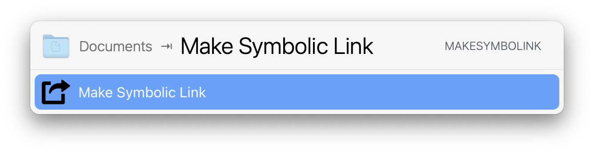

# LaunchBar Action :: Make Symbolic Link

This action will create a new symbolic link for the given path argument. The
returned result is the new symbolic link. You can take the return argument and
move it or further process it.
