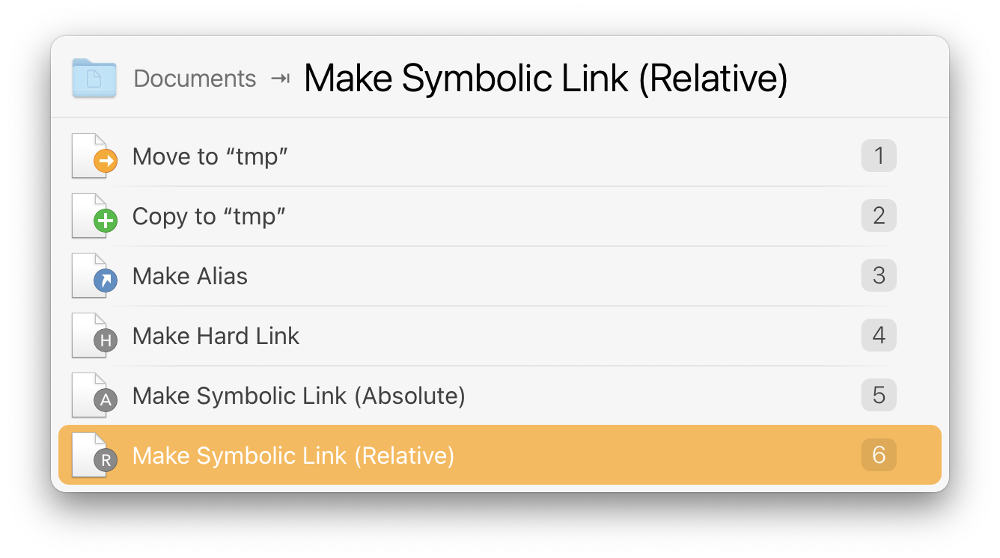

# LaunchBar Action :: Make Symbolic Link

## ⚠️ DEPRECATED

LaunchBar has native support for symbolic link creation via its [_drag and drop_ feature][dd].

[dd]: https://www.obdev.at/resources/launchbar/help/DragAndDrop.html

---

_Previous README content_

This action will create a new symbolic link for the given path argument. The
returned result is the new symbolic link. You can take the return argument and
move it or further process it.

## Download

[Download LaunchBar Action: Make Symbolic Link](https://minhaskamal.github.io/DownGit/#/home?url=https://github.com/andrewsardone/launchbar/tree/main/Make%20Symbolic%20Link) (powered by [DownGit](https://github.com/MinhasKamal/DownGit))
